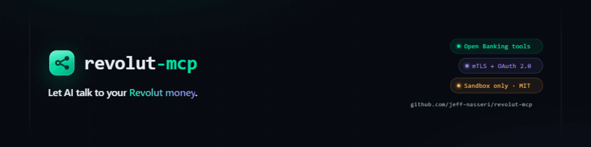

<!-- mcp-name: io.github.jeff-nasseri/revolut-mcp -->

<p align="center">
  
</p>

<h1 align="center">Revolut MCP</h1>

<p align="center">
  <a href="https://github.com/jeff-nasseri/revolut-mcp/actions/workflows/publish.yml"></a>
  <a href="https://www.npmjs.com/package/@jeffnasseri/revolut-mcp"></a>
  <a href="https://github.com/jeff-nasseri/revolut-mcp/actions/workflows/publish.yml"></a>
  <a href="LICENSE"></a>
</p>

## Overview

Revolut MCP is a [Model Context Protocol](https://modelcontextprotocol.io) server that bridges AI
assistants (Claude, Cursor, etc.) and the **Revolut Business API**. Through natural-language
requests, an assistant can list accounts and balances, browse transactions, manage counterparties,
look up live exchange rates, move money, and more — all over a clean, scope-based tool architecture.

> **Defaults to the sandbox.** Out of the box the server targets Revolut's Business **sandbox**
> (`sandbox-b2b.revolut.com`). Set `REVOLUT_ENVIRONMENT=production` only with a production
> certificate and an understanding of Revolut's API terms.

## Demo

> 📹 _Video walkthrough coming soon._
<!-- Add the recorded walkthrough link here, e.g. https://github.com/user-attachments/assets/XXXXXXXX -->

## Documentation

📚 **[Full Documentation](docs/README.md)** — installation, authentication, tool reference, and examples.

### Quick Links

- **[Installation](docs/getting-started/installation.md)** — npm, source, or Docker
- **[Authentication](docs/getting-started/authentication.md)** — certificate setup and the OAuth flow
- **[Testing](docs/getting-started/testing.md)** — unit and live integration tests
- **[Claude Desktop](docs/integrations/claude-desktop.md)** — editor integration
- **[Tool Reference](docs/README.md#tool-reference)** — every tool, by scope
- **[Contributing](CONTRIBUTING.md)** — add a tool or scope

## Features

Tools are grouped into scopes (`src/scope/<scope>/`):

| Scope | Tools |
|---|---|
| **auth** | `setup_auth`, `complete_auth` |
| **accounts** | `get_accounts`, `get_account`, `get_account_bank_details` |
| **transactions** | `get_transactions`, `get_transaction` |
| **counterparties** | `get_counterparties`, `get_counterparty`, `create_counterparty`, `delete_counterparty` |
| **payments** | `get_payment_drafts`, `get_transfer_reasons`, `create_payment`, `transfer_between_accounts`, `cancel_transaction` |
| **foreign-exchange** | `get_exchange_rate`, `exchange_currency` |
| **team** | `get_team_members` |
| **sandbox** | `simulate_topup`, `simulate_transaction_state` |

Read-only tools are safe by default; money-moving tools (`create_payment`, `transfer_between_accounts`,
`exchange_currency`) and destructive tools (`delete_counterparty`, `cancel_transaction`) are annotated
accordingly so clients can prompt for confirmation.

## Quick Start

```bash
# 1. Install
npm install -g @jeffnasseri/revolut-mcp     # or: npx @jeffnasseri/revolut-mcp

# 2. Generate a key pair and upload the public cert in the Revolut Business portal
#    (Settings → APIs → Business API). See the Authentication guide.
openssl genrsa -out certs/privatekey.pem 2048
openssl req -new -x509 -key certs/privatekey.pem -out certs/publickey.cer -days 1825 -subj "/CN=revolut-mcp"

# 3. Configure
cp .env.sandbox.template .env   # fill in REVOLUT_CLIENT_ID, key path, redirect URI

# 4. Run
revolut-mcp                      # or: node dist/index.js
```

Then authorize once: ask your assistant to call **`setup_auth`**, approve in the browser, and call
**`complete_auth`** with the returned `code`. Full details in the
**[Authentication guide](docs/getting-started/authentication.md)**.

### Configuration

| Variable | Required | Description |
|---|---|---|
| `REVOLUT_CLIENT_ID` | Yes | Client ID from the Business portal |
| `REVOLUT_PRIVATE_KEY_PATH` | Yes\* | Path to the PEM private key that signs the JWT |
| `REVOLUT_PRIVATE_KEY` | Yes\* | PEM contents inline (alternative to the path; handy in containers) |
| `REVOLUT_REDIRECT_URI` | No | OAuth redirect URI (default `https://example.com/`) |
| `REVOLUT_JWT_ISS` | No | JWT issuer (defaults to the redirect URI host) |
| `TOKEN_STORE_PATH` | No | Token store location (default `./.tokens.json`) |
| `REVOLUT_ENVIRONMENT` | No | `sandbox` (default) or `production` |

\* Provide one of `REVOLUT_PRIVATE_KEY_PATH` or `REVOLUT_PRIVATE_KEY`.

## Docker

```bash
docker run -i --rm \
  -e REVOLUT_CLIENT_ID=your_client_id \
  -e REVOLUT_PRIVATE_KEY="$(cat certs/privatekey.pem)" \
  -e REVOLUT_REDIRECT_URI=https://example.com/ \
  ghcr.io/jeff-nasseri/revolut-mcp:latest
```

## Development

```bash
npm install          # install dependencies
npm run dev          # run with ts-node (no build step)
npm run build        # compile TypeScript → dist/
npm test             # unit tests
npm run test:coverage
npm run lint         # type-check only
```

Versioning is driven by [GitVersion](https://gitversion.net/) (`GitVersion.yml`) from
[Conventional Commits](https://www.conventionalcommits.org/): `feat:` → minor, `fix:`/`chore:`/etc.
→ patch, `docs:` → no bump. A push to `master` publishes to npm and GHCR.

## Security

See **[SECURITY.md](SECURITY.md)**. In short: never commit your private key, `.env`, or
`.tokens.json`; grant the minimum OAuth scopes you need; and treat the token store like a password.

## Disclaimer

This is an **unofficial, community project** and is not affiliated with, endorsed by, or supported by
Revolut Ltd. Use at your own risk and review the code before connecting it to any account.

## License

[MIT](LICENSE)
